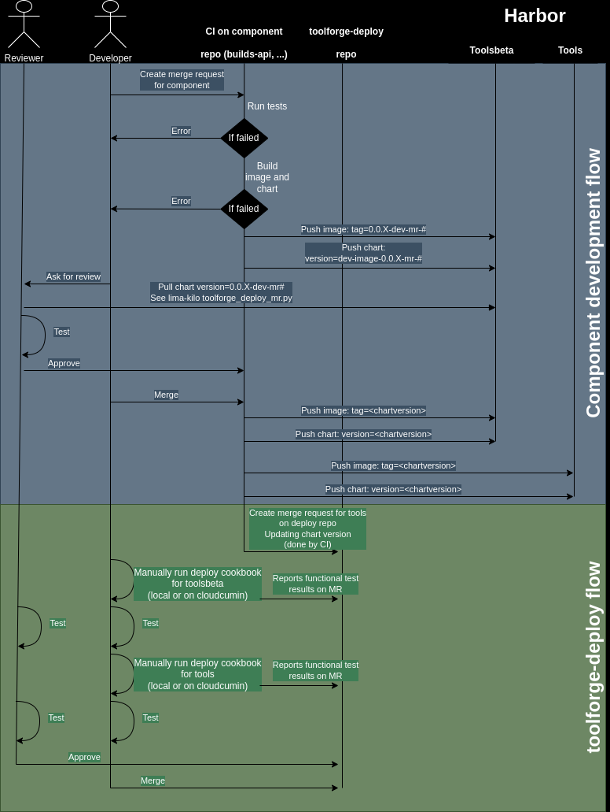

# Toolforge deploy repository

This repository hosts the per-component code to deploy an instance of toolforge.

## Expected development flow

Note that the user does not need to write the image tag anywhere, only care
about the chart version.

Every chart version is bound to its own image tag.



This is implemented in the cicd/gitlab-ci repository:
<https://gitlab.wikimedia.org/repos/cloud/cicd/gitlab-ci/>

## Deploying locally/by hand

Useful if you have your local minikube/kind for testing (see also
[lima-kilo](Portal:Toolforge/Admin/lima-kilo)). To get started, run

```bash
./deploy.sh --help
```

## Updating Component Versions

### Via CI

When a new version of a component is available,
[a CI job](https://gitlab.wikimedia.org/repos/cloud/cicd/gitlab-ci/-/blob/main/toolforge-cd/create_toolforge_deploy_mr.yaml?ref_type=heads)
takes care of automatically creating a new branch with the updated component
version. This script will also generate a commit message detailing the version
change and any associated bug fixes, and open a version-bump MR.

In case you ever need to deploy a new version of a component manually, read the
next section for instructions. Otherwise, all that is left is testing the
updated component on Toolsbeta and Toolforge before merging the version-bump MR.

### Manual Update of Component Versions

```bash
utils/create_upgrade_branch.sh <COMPONENT>
```

Replace `<COMPONENT>` with the name of the component you want to upgrade.

This script will:

1. Check out a new branch named `bump_<COMPONENT>`.
2. Reset the branch to the latest `main`.
3. Run the `update_component.sh` script to update the component version.
4. If there are changes (i.e., a new version is available), it will commit these
   changes with a detailed commit message.

The commit message includes:

- The component name and new version.
- The previous version and new version.
- A link to the release notes for the new version.
- Any associated bug fixes between the two versions.

After running the script, if a new version was found, the branch is ready to be
pushed and a merge request can be created.

For GitLab CLI users, you can create a merge request with:

```bash
glab mr create --fill --label 'Needs review' --remove-source-branch --yes
```

Otherwise, you can push the branch and manually create the merge request.

## Deploying on Toolsbeta and Toolforge

We use a cookbook to deploy the components on this repository, that will clone
this repository and deploy the component on the right cluster. The cookbook is
[`wmcs.toolforge.k8s.component.deploy`](https://gerrit.wikimedia.org/g/cloud/wmcs-cookbooks#installation%20cookbook):

```bash
user@laptop:~$ cookbook wmcs.toolforge.k8s.component.deploy -h
usage: cookbooks.wmcs.toolforge.k8s.component.deploy [-h] --cluster-name {tools,toolsbeta} [--task-id TASK_ID] [--no-dologmsg] (--component COMPONENT | --git-url GIT_URL) [--git-name GIT_NAME] [--git-branch GIT_BRANCH] [--deployment-command DEPLOYMENT_COMMAND]

WMCS Toolforge Kubernetes - deploy a kubernetes custom component

Usage example:
    cookbook wmcs.toolforge.k8s.component.deploy \
        --cluster-name toolsbeta \
        --component jobs-api

options:
  -h, --help            show this help message and exit
  --cluster-name {tools,toolsbeta}
                        cluster to work on (default: None)
  --task-id TASK_ID     Id of the task related to this operation (ex. T123456). (default: None)
  --no-dologmsg         To disable dologmsg calls (no SAL messages on IRC). (default: False)
  --component COMPONENT
                        component to deploy from the toolforge-deploy repo (default: None)
  --git-url GIT_URL     git URL for the source code (default: None)
  --git-name GIT_NAME   git repository name. If not provided, it will be guessed based on the git URL (default: None)
  --git-branch GIT_BRANCH
                        git branch in the source repository (default: main)
  --deployment-command DEPLOYMENT_COMMAND
                        command to trigger the deployment. (default: ./deploy.sh)
```

## Secrets

The secrets are pulled from a yaml file, by default it's
/etc/toolforge-deploy/secrets.yaml (populated by puppet on the control nodes).

You can specify an alternative file with the env var
SECRETS_FILE=/my/custom/secrets.yaml when running the deploy.sh script:

```bash
SECRETS_FILE=$PWD/test_secrets.yaml ./deploy.sh builds-api
```

In the values files templates (\*.yaml.gotmpl) you can get a secret with:

```bash
myVariable: {{ exec "../../helpers/get_secret.sh" (list "mySecret") }}
```

And you can try getting a secret manually by running the script directly:

```bash
> components/helpers/get_secret.sh mySecret
```

Note that if the secret does not exist, the template generation will fail with a
not-very-clear error from helmfile:

```bash
in ./helmfile.yaml: error during helmfile.yaml.part.0 parsing: template: stringTemplate:11:22: executing "stringTemplate" at <.Values.chartRepository>: map has no entry for key "chartRepository"
```

## K8s version compatibility

Currently we update these values manually, you can check all the compatibility
restrictions for your environment with:

```bash
> git grep kubeVersion: '*local.yaml*'
```

replacing `local` with your environment (ex. `tools`).

## Documentation for the services

See:

- [General toolforge](https://wikitech.wikimedia.org/wiki/Portal:Toolforge/Admin)
- [Jobs service](https://wikitech.wikimedia.org/wiki/Portal:Toolforge/Admin/Kubernetes/Jobs_framework)
- [Build service](https://wikitech.wikimedia.org/wiki/Portal:Toolforge/Admin/Build_Service)
- [Envvars service](https://wikitech.wikimedia.org/wiki/Portal:Toolforge/Admin/Envvars_Service)
- [Ingress nginx](https://wikitech.wikimedia.org/wiki/Portal:Toolforge/Admin/Kubernetes/Networking_and_ingress)
- [Kubernetes metrics](https://wikitech.wikimedia.org/wiki/Portal:Toolforge/Admin/Kubernetes#Monitoring)

## Components

### API Gateway

This component is the entrypoint of any request to any toolforge API.

[Source code here](https://gitlab.wikimedia.org/repos/cloud/toolforge/api-gateway)

### Builds API

Part of the build service, main API that users interact with, entry point for
build related requests.

[Source code here](https://gitlab.wikimedia.org/repos/cloud/toolforge/builds-api)

### Builds Builder

Part of the build service, this is the component that actually builds and pushes
the images, currently based on tekton pipelines.

[Source code here](https://gitlab.wikimedia.org/repos/cloud/toolforge/builds-builder)

### Calico

[Kubernetes CNI](https://kubernetes.io/docs/concepts/extend-kubernetes/compute-storage-net/network-plugins/)
that we use.

[Source code here](https://gitlab.wikimedia.org/repos/cloud/toolforge/calico)

### Cert Manager

Service to generate and reload the ssl certificates for any other component. We
have no code for it as we use directly upstream charts.

### Envvars Admission

Part of the envvars service, it injects the envvars (currently k8s secrets) into
the pods that need them.

[Source code here](https://gitlab.wikimedia.org/repos/cloud/toolforge/envvars-admission)

### Envvars API

Part of the envvars service, main API that users interact with, entry point for
envvar related requests.

[Source code here](https://gitlab.wikimedia.org/repos/cloud/toolforge/envvars-api)

### Image config

Configuration with the list of images available for the jobs service and
webservice cli.

[Source code here](https://gitlab.wikimedia.org/repos/cloud/toolforge/image-config)

### Ingress admission

Validates that ingress objects created by users don't interfere with other
users.

[Source code here](https://gitlab.wikimedia.org/repos/cloud/toolforge/ingress-admission)

### Ingress nginx

This is
[ingress element of k8s](https://kubernetes.io/docs/concepts/services-networking/ingress/)
that we use for http requests for tool webservices.

We have no code for it as we use upstream charts.

### Jobs API

Part of the jobs service, main API that users interact with, entry point for job
related requests.

[Source code here](https://gitlab.wikimedia.org/repos/cloud/toolforge/jobs-api)

### Jobs emailer

Part of the jobs service, this component takes care to email users when jobs
finish or fail.

[Source code here](https://gitlab.wikimedia.org/repos/cloud/toolforge/jobs-emailer)

### Maintain kubeusers

Takes care of creating all the bits and pieces necessary (ex. home directory,
k8s certs, ...) for new toolforge users.

[Source code here](https://gitlab.wikimedia.org/repos/cloud/toolforge/maintain-kubeusers)

### Registry admission

Validation webhook that makes sure new pods are only using images from
registries we allow.

[Source code here](https://gitlab.wikimedia.org/repos/cloud/toolforge/registry-admission)

### Volume admission

Takes care of adding the volumes for NFS, dumps and similar directories to user
created pods.

[Source code here](https://gitlab.wikimedia.org/repos/cloud/toolforge/volume-admission)

### WMCS k8s metrics

Part of Kubernetes metrics, set of tools to gather and expose metrics for
prometheus (or similar) to gather.

[Source code here](https://gitlab.wikimedia.org/repos/cloud/toolforge/wmcs-k8s-metrics)

This includes the following components:

- `cadvisor` generates Prometheus metrics about the Docker daemon and running
  containers.
- `kube-state-metrics` generates Prometheus metrics about Kubernetes API
  objects.
- `metrics-server` generates data for the Kubernetes metrics API (which powers
  `kubectl top`).
- `prometheus-rbac` generates access control rules so Prometheus can scrape
  workloads inside Kubernetes.

## Functional tests

There's a suite of functional tests that use
[bats-core](https://bats-core.readthedocs.io/) (you can easily install it in a
venv using the pip package `bats-core-pkg`), they are meant to be run inside
lima-kilo, or as a tool in any toolforge installation.

To run from a tool just use the script:

```bash
mytool$ git clone https://gitlab.wikimedia.org/repos/cloud/toolforge/toolforge-deploy
mytool$ toolforge-deploy/helpers/run_functional_tests.sh
```

To run them inside lima-kilo
[see the lima-kilo docs](https://gitlab.wikimedia.org/repos/cloud/toolforge/lima-kilo).

### Developing new tests

Remember to add the line `# bats file_tags=<component>` to the new tests when
adding tests for new components, that helps filtering out later with
`--filter-tag <component>`.

More information:
<https://wikitech.wikimedia.org/wiki/Portal:Toolforge/Admin/Kubernetes#Monitoring>
